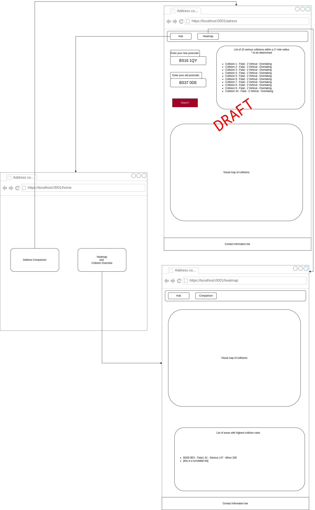
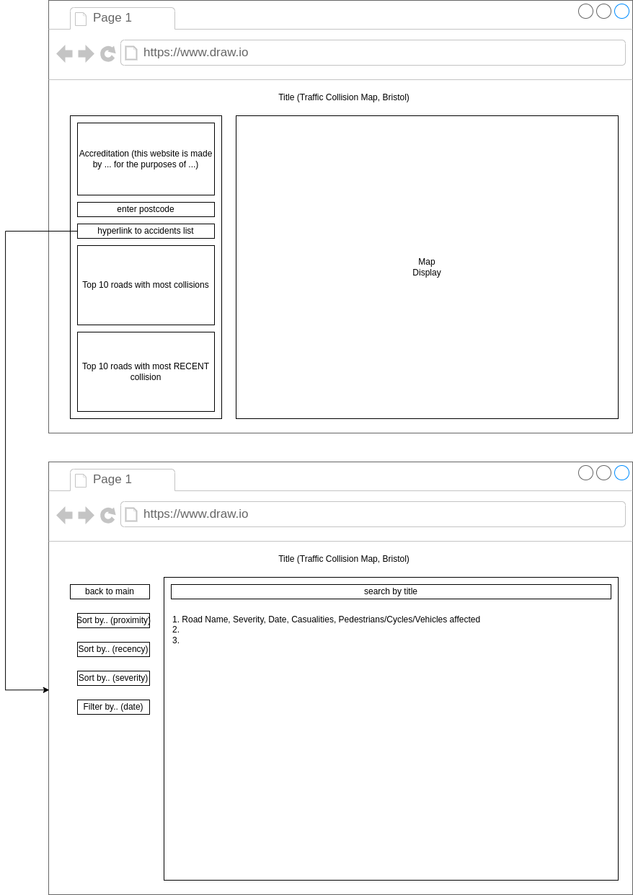

# Design

## User Interface design

Our design philosophy focuses around comprehension: accessibility and simplicity. These two factors which work hand-in-hand to provide powerful and seamless user experiences.

| **Accessibility** | <u>For all Devices</u> Our website will incorporate user friendly style sheets that work in both horizontal and vertical displays - for example, computer and phones displays. This will be tested by accessing the device on both device types, as well as utilising viewport manipulation tools.  <u>For all Users</u> Colour palette used should be colour-blindness friendly. |
| ----------------- | ------------------------------------------------------------ |
| **Simplicity**    | <u>Set Colour Palette</u> Should not be visually noisy and crowded. A set palette combats this and can be carefully chosen to link with colour-blind friendliness.  <u>One Function Per Page</u> To avoid obfuscation and visual confusion, each page should only have one major function, with clear and concise hyperlinks leading to new functions. For a topical example, a map on one page, a clear database list on the next. |

## Wireframes

The purpose of the following low fidelity wire-frames are to help sketch out and plan out design elements before hand. 
They have undergone a series of feedback loops to be improved, which provides crucial data on how we can incorporate strengths of each design into the development of a final web page. The feedback and critical points are as follows:

### WIREFRAME A: 

| STRENGTHS                                                    | WEAKNESSES                                                   |
| ------------------------------------------------------------ | ------------------------------------------------------------ |
| Vertical Display friendly                                    | Too many functions available at once, could hinder user comprehension |
| User friendly: Large buttons and text inputs. well spaced.   |                                                              |
| Sorts functions (Map, and Database list) into different pages |                                                              |

### WIREFRAME B:

| STRENGHTS                                                    | WEAKNESSES                                                   |
| ------------------------------------------------------------ | ------------------------------------------------------------ |
| Privvy to horizontal/computer displays                       | May prove weak when transitioning to mobile (vertical) displays |
| Sorts functions (Map, and Database list) into different pages | Many input screens are bunched up together, may confuse user |

## Initial Design Conclusion

Some key elements to take forth into the developments of final stages are as follows:

- A design that works well both on computer and mobile displays.
- Split core functions into different pages
- Keep and utilise a core, accessible, colour palette
- Space UI well, to avoid visual noise
- Title inputs clearly and concisely.
