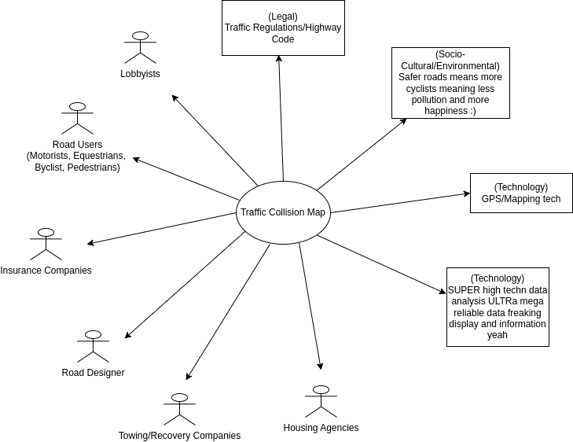

# Project Proposal

## Business Case

### Problem statement

| Urban Navigators  | Road Users (Car drivers, cyclists, motorists, etc) Pedestrians (Disabled people, parents, hikers, etc) |
| ----------------- | ----------------------------------------------------------------------------------------------------------- |
| Highway Authority | Traffic engineers Towing/recovery services Highway authority/police                               |
| Statisticians     | Insurance Brokers Lobbyists/protesters                                                                 |

Picture the following: you are a parent and your child has just become the age in which they are to travel to and from school on their own. You are, naturally, wracked with anxiety that they arrive safely, especially considering that you live in a very urban environment.
Our product allows you to assess traffic collision history in your city to quickly and clearly assess dangerous areas, and plan a prompt and safe route, and can rest easily.

Such a product provides benefits for many more clients than this: Urban Navigators, Highway Authority, and Statisticians. Key actor groups being suggested above.

For example, traffic engineers, towing services and highway authority all benefit from being able to highlight key problem areas, whether to propose fixes, or to situate more towing or police vehicles within a certain area.

### Business benefits

Our product aim is to bridge the gap between the public and factual traffic data.
This project will allow people to see a visualisation of injury's on the roads in Bristol for different modes of transport.
This will allow people to become involved in the democratic process of road safety.

This project will allow people to make more informed decisions about their routes and mode of travel.

### Options Considered

There are not many publicly available tools that provide such a service, likely due to the perceived lack in monetary potential.

A primary public alternative is as follows:

- OpenDataBristol - Users could just manually review the data
  NOTE: There are other local authority that publish data in this way (e.g. London) but they all fall under this category

While not serving clientele niche, the following provides a similar type of service:

- [BinMapUK](https://binmap.uk/)

### Expected Risks

- Risk of negative feedback from the Council if this leads to increased scrutiny of their work
- Risk of negative sentiment towards users of a mode of travel if this data shows that they are involved in the majority of collisions.
- Risk of inaccurate or misleading presentation of data, leading to someone going down a more dangerous route.

## Project Scope

- Display analysed Traffic Collision Data
- Having a visual display using a map
- Allow users to access the database visually
- Allows users to filter through data points
- Potential an account system for commercial use. (Could charge for a licence like causeways one network)
- An adjustable system that could have the potential to expand further than one city

