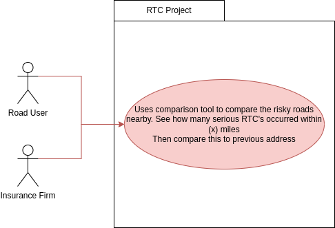
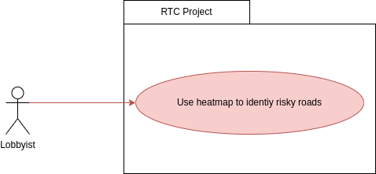

# Requirements

## User Needs

### User stories

Our website is a tool that we provide for a function: to visually display traffic collision and accidents data in Bristol. 
Why is this useful? Each user has their own reasoning for accessing and using our product. It is essential to understand our clientele during development, as it allows us to fixate on, or implement, features that improve our intended experience.

Using "User Stories" is a business analyst technique which allow us to understand requirements from the perspective of our userbase.

| As an insurance broker I want to see how a client moving house will affect the risk that I am insuring, so that I can charge more if they are increasing risk. |
| ------------------------------------------------------------ |
| As a motorist I want to see how me moving house may affect my insurance premiums so I can see how much my yearly premiums may increase/decrease so I can budget more accurately. |
| As a commuter and pedestrian I want to see hotspots for car crashes so I know where I need to be more cautious, what areas I might need to avoid, or the nature of common accidents in the area. |
| As a lobbyist I want to see hotspots for fatal crashes so I can highlight key problem areas and put pressure on the highway department to improve the infrastructure there. |
| As a parent, I want to mark key accident hotspots so I can plan my child's route to and from school with consideration of dangerous areas |
| As a traffic engineer, I want to be able to clearly and visually point to common points on weakness in traffic infrastructure, so I may highlight key areas of issue and propose solutions to higher ups. |
| As highway authority, I want to know where fatal accidents happen due to speeding, so I may more closely monitor critical areas. |

### Actors

Actors are key figures within our model. They are people who will use our tool on the regular, are most effected by changes and features on our site, as well as being the users we should be more considerate of.

In our traffic collision display, safety is a key concern. But safety affects different users in categorically different ways, the following actors are vital to listen to:

| Urban Navigators  | Road Users (Car drivers, cyclists, motorists, etc)  Pedestrians (Disabled people, parents, hikers, etc) |
| ----------------- | ------------------------------------------------------------ |
| Highway Authority | Traffic engineers  Towing/recovery services Highway authority/police |
| Statisticians     | Insurance Brokers Lobbyists/protesters                  |

### Use Cases
| UC1               | Usage as an insurance tool                                                                                                                                                                                      | 
|-------------------|-----------------------------------------------------------------------------------------------------------------------------------------------------------------------------------------------------------------|
| **Description**   | What areas have the most accidents? Vary rates based upon the provided data.                                                                                                                                    |
| **Actors**        | Insurers, Insurees                                                                                                                                                                                              |
| **Assumptions**   | We assume that the involved are a motorist, and legally require insurance                                                                                                                                       |
|                   | Accessibility: We assume everyone can see the website                                                                                                                                                           |
| **Steps**         | 1. Opt to highlight a key area   2. Request for traffic data within that area 3. Highlight all relevant traffic collisions in that area 4. Display table of all relevant data within the Bristol area  |
| **Variations**    | Accessibility: Users may not always be able to visually use the website, but still may desire access to the data. Having nonvisual (textual) data formatting will help.                                         |
| **Non-functional** | Service should run on all modern browsers (i.e Chromium based browsers, firefox)                                                                                                                                |
| **Issues**        | Serving data in non-map form is likely to be cost prohibitive, as we would need to reverse geocode all 4,000 incidents every time.                                                                              |

| **UC2**            |                                                              |
| ------------------ | ------------------------------------------------------------ |
| **Description**    | Using the platform to find hotspots for fatal crashes to be able to apply more pressure to elected officials and the councle traffic dept. To redesign roads to improve safety. |
| **Actors**         | Lobbyists Councle Road Users                           |
| **Assumptions**    | There is a road on within the network with a substantial number of fatal crashes that has not been improved since the incident. |
| **Steps**          | 1) Lobbyist looks at the heat map using the filter to only show Fatal collisions 2) Lobbyist identifys the road with a large amounts of fatal injurys and checks to see if it has been improved since the last crash 3) Lobbyist informs the coulcle highways dept to ask for it to be improved 3.1) If the councle ignore the issue then they should speak to their MP  3.2) If the MP ignores this issue go to the local press and speak to the MP again after. |
| **Variations**     | None                                                         |
| **Non-functional** |                                                              |

## Software Requirements Specification
### Functional requirements
#### FR1 [UC1] 
The system shall present two input boxes to take input of two post codes. 
One postcode being the users previous postcode and the other being their new postcode. 

#### FR2 [UC1]
The system shall generate a list of top ten roads within a user defined radius that have had collisions on them. 
These will be presented in order of most incidents to least. 

#### FR3 [UC2] 
The system should generate a list of every collision in Bristol in a format that is able to be overlay-ed onto a map.

### Non-Functional Requirements

#### N-FR1 [UC1]
The system could also present the data plotted onto a map as a visual aid for users. 

#### N-FR2 [UC2] 
The system could also present collision data points on a map in the form of a heat mzap. As a visual aid to make it easier to understand. 

#### N-FR3 [UC1 & UC2]
The system should present an menu for the user to filter collision by their category. 
e.g (Minor,Serious,Fatal)

#### N-FR4 [UC2]
The system could load the map at broad mead if Geo-location is not available from the browser